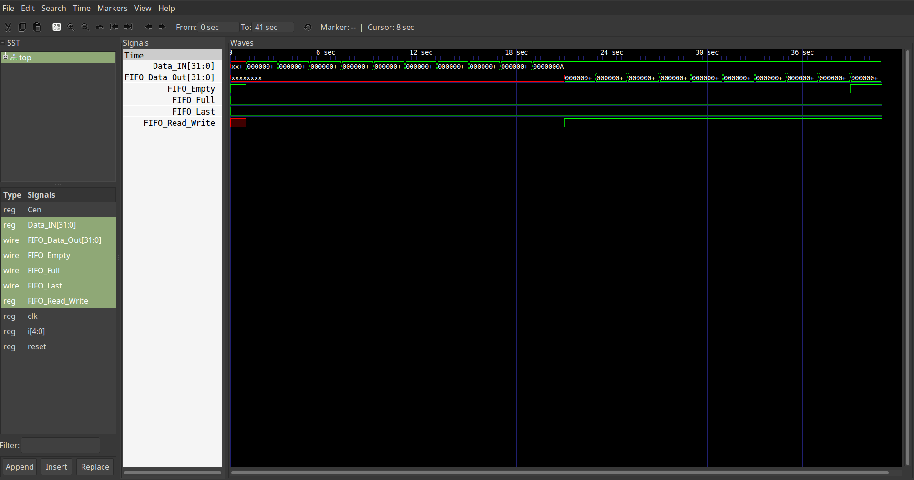
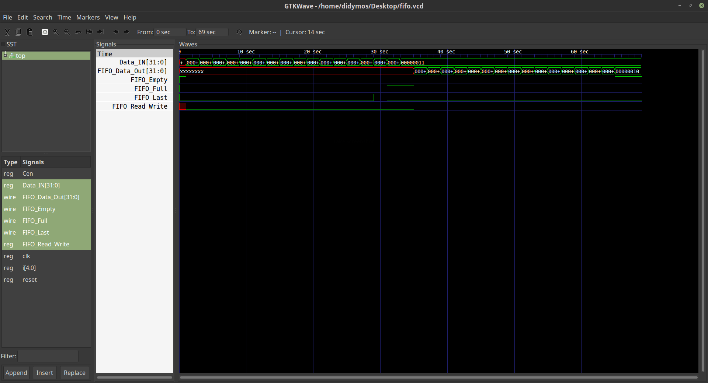

# FIFO_HUA-MCA-2016-2017
This is a simple FIFO queue implementation in Verilog for the Modern Computer Architectures course (2016-2017) of Harokopio University.

## Prerequisites
1. Verilog compiler. Use `apt-get install iverilog` or follow [this guide](http://iverilog.wikia.com/wiki/Installation_Guide) to install.
2. [__Optional__] [GTKWave](http://gtkwave.sourceforge.net/) for visual representation. Install using `apt-get install gtkwave`

## To execute this FIFO implementation you have to:
1. Clone this repository using: `https://github.com/galexandridis/FIFO_HUA-MCA-2016-2017.git`
2. Move to the folder of the repository `cd FIFO_HUA-MCA-2016-2017`
3. Compile using `iverilog fifo.v -o fifo.out`
4. Execute using `./fifo.out`
5. To see the diagrams produced use `gtkwave fifo.vcd`

## Explanation

The project consists of 2 modules, the fifo module, which contains the implementation of the FIFO queue and the top module,
which uses the fifo module, in order to confirm that it works correctly.

### Module fifo:
Takes as inputs the signals:
1. clk: used in order to execute the module in every positive pulse of the clock.
2. Cen: enables/disables the module.
3. Reset: resets the queue.
4. Data_IN: input data to store in queue.
5. FIFO_Read_Write: control of read/write operation from/to queue.

Produces as output the signals:
1. FIFO_Empty: 1 when queue is empty.
2. FIFO_Full: 1 when queue is full.
3. FIFO_Last: 1 when queue has 1 free slot remaining.
4. FIFO_Data_Out: output data to read from queue.

Apart from the signals mentioned above, some variables also used are:
1. Data[15:0]: 16-slot table representing the queue's memory.
2. i: index for the initialization/reset of the Data table
3. ptr_r: pointer that holds the position for the read operation from queue. After each read operation it's incremented by 1, in order to show the next position to read. When it reaches the last slot it's starts again from 0.
4. ptr_w: pointer that keeps the write position in the queue (same as ptr_r)
5. cntr: counter of slots used, incremented by 1 in every write operation and decremented by 1 in every read operation, max value: 16, min value: 0

## Results of execution

### Writing 10 numbers to queue and reading them:
```
$ ./fifo.out 
VCD info: dumpfile fifo.vcd opened for output.
                   0|RW=x, Data_IN=         x, FIFO_Data_Out=         x
                   1|RW=0, Data_IN=         1, FIFO_Data_Out=         x
                   3|RW=0, Data_IN=         2, FIFO_Data_Out=         x
                   5|RW=0, Data_IN=         3, FIFO_Data_Out=         x
                   7|RW=0, Data_IN=         4, FIFO_Data_Out=         x
                   9|RW=0, Data_IN=         5, FIFO_Data_Out=         x
                  11|RW=0, Data_IN=         6, FIFO_Data_Out=         x
                  13|RW=0, Data_IN=         7, FIFO_Data_Out=         x
                  15|RW=0, Data_IN=         8, FIFO_Data_Out=         x
                  17|RW=0, Data_IN=         9, FIFO_Data_Out=         x
                  19|RW=0, Data_IN=        10, FIFO_Data_Out=         x
                  21|RW=1, Data_IN=        10, FIFO_Data_Out=         1
                  23|RW=1, Data_IN=        10, FIFO_Data_Out=         2
                  25|RW=1, Data_IN=        10, FIFO_Data_Out=         3
                  27|RW=1, Data_IN=        10, FIFO_Data_Out=         4
                  29|RW=1, Data_IN=        10, FIFO_Data_Out=         5
                  31|RW=1, Data_IN=        10, FIFO_Data_Out=         6
                  33|RW=1, Data_IN=        10, FIFO_Data_Out=         7
                  35|RW=1, Data_IN=        10, FIFO_Data_Out=         8
                  37|RW=1, Data_IN=        10, FIFO_Data_Out=         9
                  39|RW=1, Data_IN=        10, FIFO_Data_Out=        10
```

### GTKWave Representation:


### Writing 17 numbers to queue and reading them:
```
$ ./fifo.out 
VCD info: dumpfile fifo.vcd opened for output.
                  0|RW=x, Data_IN=         x, FIFO_Data_Out=         x
                  1|RW=0, Data_IN=         1, FIFO_Data_Out=         x
                  3|RW=0, Data_IN=         2, FIFO_Data_Out=         x
                  5|RW=0, Data_IN=         3, FIFO_Data_Out=         x
                  7|RW=0, Data_IN=         4, FIFO_Data_Out=         x
                  9|RW=0, Data_IN=         5, FIFO_Data_Out=         x
                  11|RW=0, Data_IN=         6, FIFO_Data_Out=         x
                  13|RW=0, Data_IN=         7, FIFO_Data_Out=         x
                  15|RW=0, Data_IN=         8, FIFO_Data_Out=         x
                  17|RW=0, Data_IN=         9, FIFO_Data_Out=         x
                  19|RW=0, Data_IN=        10, FIFO_Data_Out=         x
                  21|RW=0, Data_IN=        11, FIFO_Data_Out=         x
                  23|RW=0, Data_IN=        12, FIFO_Data_Out=         x
                  25|RW=0, Data_IN=        13, FIFO_Data_Out=         x
                  27|RW=0, Data_IN=        14, FIFO_Data_Out=         x
                  29|RW=0, Data_IN=        15, FIFO_Data_Out=         x
Warning: one more empty slot in queue
                  31|RW=0, Data_IN=        16, FIFO_Data_Out=         x
Error: queue is full
                  33|RW=0, Data_IN=        17, FIFO_Data_Out=         x
                  35|RW=1, Data_IN=        17, FIFO_Data_Out=         1
                  37|RW=1, Data_IN=        17, FIFO_Data_Out=         2
                  39|RW=1, Data_IN=        17, FIFO_Data_Out=         3
                  41|RW=1, Data_IN=        17, FIFO_Data_Out=         4
                  43|RW=1, Data_IN=        17, FIFO_Data_Out=         5
                  45|RW=1, Data_IN=        17, FIFO_Data_Out=         6
                  47|RW=1, Data_IN=        17, FIFO_Data_Out=         7
                  49|RW=1, Data_IN=        17, FIFO_Data_Out=         8
                  51|RW=1, Data_IN=        17, FIFO_Data_Out=         9
                  53|RW=1, Data_IN=        17, FIFO_Data_Out=        10
                  55|RW=1, Data_IN=        17, FIFO_Data_Out=        11
                  57|RW=1, Data_IN=        17, FIFO_Data_Out=        12
                  59|RW=1, Data_IN=        17, FIFO_Data_Out=        13
                  61|RW=1, Data_IN=        17, FIFO_Data_Out=        14
                  63|RW=1, Data_IN=        17, FIFO_Data_Out=        15
                  65|RW=1, Data_IN=        17, FIFO_Data_Out=        16
Error: queue is empty

```

### GTKWave Representation:

